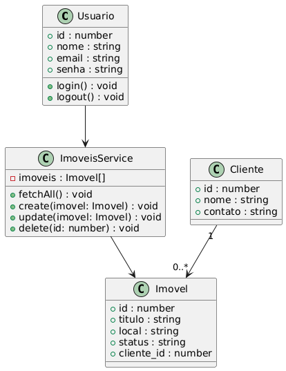
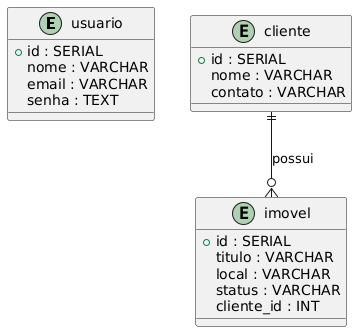

# CRM Imobiliário - Projeto de Software

Sistema de gerenciamento de clientes, imóveis e negociações para pequenas e médias imobiliárias, feito em Nuxt, uma framework full-stack para desenvolvimento web, que utiliza Vue.js no frontend e Node.js no backend.

Entrega do Trabalho Final para a disciplina **Projeto de Software - ADS163**.

---

## Funcionalidades

- **Login / Logout** de usuário (simulado).
- **Dashboard** com informações (clientes, imóveis, negociações).
- **CRUD de Imóveis**: criar, editar, excluir e listar imóveis. Comunicação com backend via composable `useImoveis`.

---

## Diagrama UML

### Diagrama de Classes



### Diagrama Entidade-Relacionamento (ER)



---

## Princípios SOLID aplicados

- **SRP (Single Responsibility Principle):** o arquivo `useImoveis.ts` tem responsabilidade única: gerenciar imóveis.
- **DIP (Dependency Inversion Principle):** comunicação entre frontend e backend via API REST, abstraindo detalhes de implementação.
- **OCP (Open/Closed Principle):** funções de CRUD podem ser estendidas sem modificar o código existente.

---

## Design Patterns utilizados

- **Singleton:** o arquivo `db.ts` cria uma única instância do Pool do PostgreSQL que é exportada e usada em toda a API REST do backend.
- **Facade Pattern:** o arquivo `useImoveis.ts` fornece uma interface simplificada para o frontend interagir com múltiplas operações de imóveis sem precisar lidar diretamente com $fetch ou endpoints da API.
- **Observer:** a framework Vue atualiza automaticamente a UI ao alterar dados, através do seu sistema reativo.

---

## Execução do Projeto

1. Instale dependências:

```bash
npm install
```

2. Configure o banco PostgreSQL e rode `seed.sql` no banco de dados.

3. Inicie o servidor de desenvolvimento:

```bash
npm run dev
```

4. Acesse: `http://localhost:3000`

---
